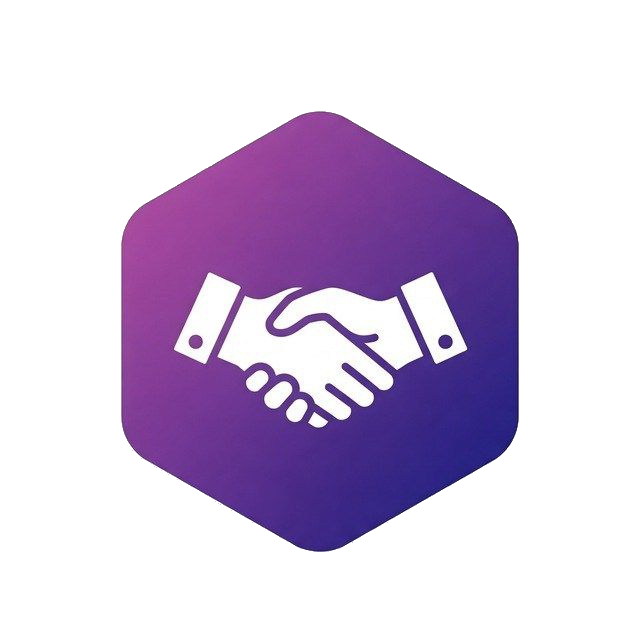
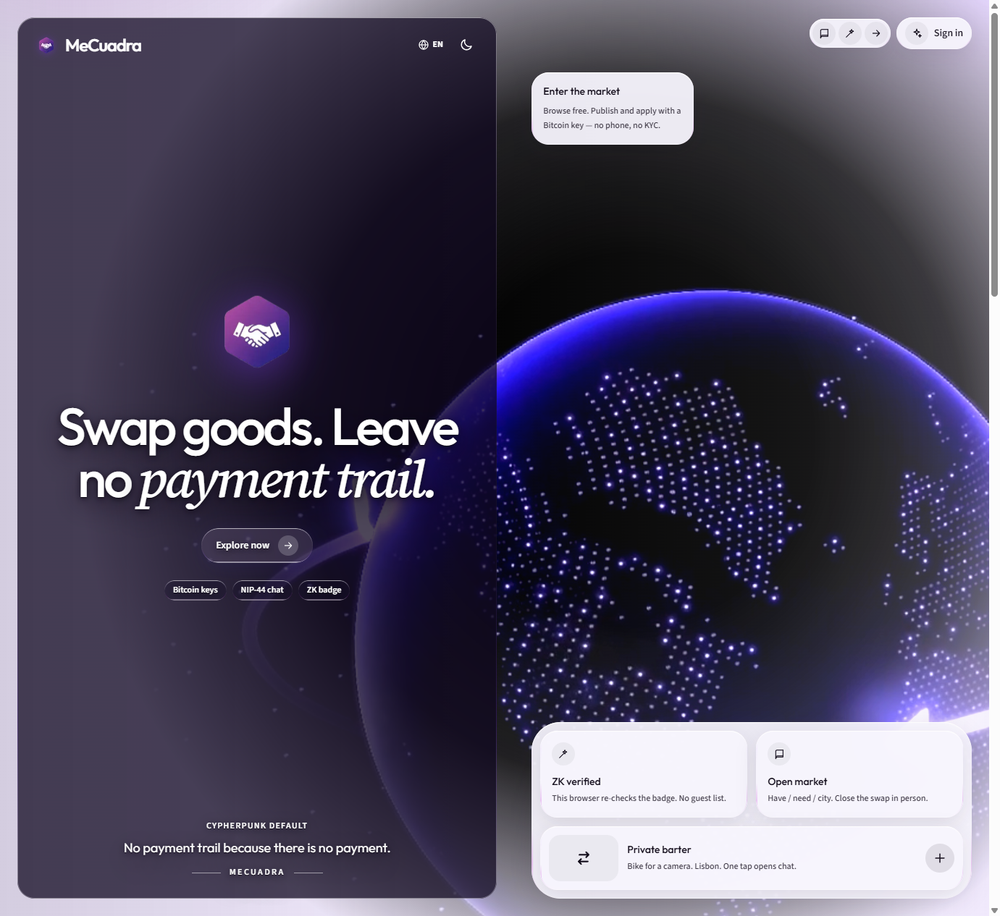
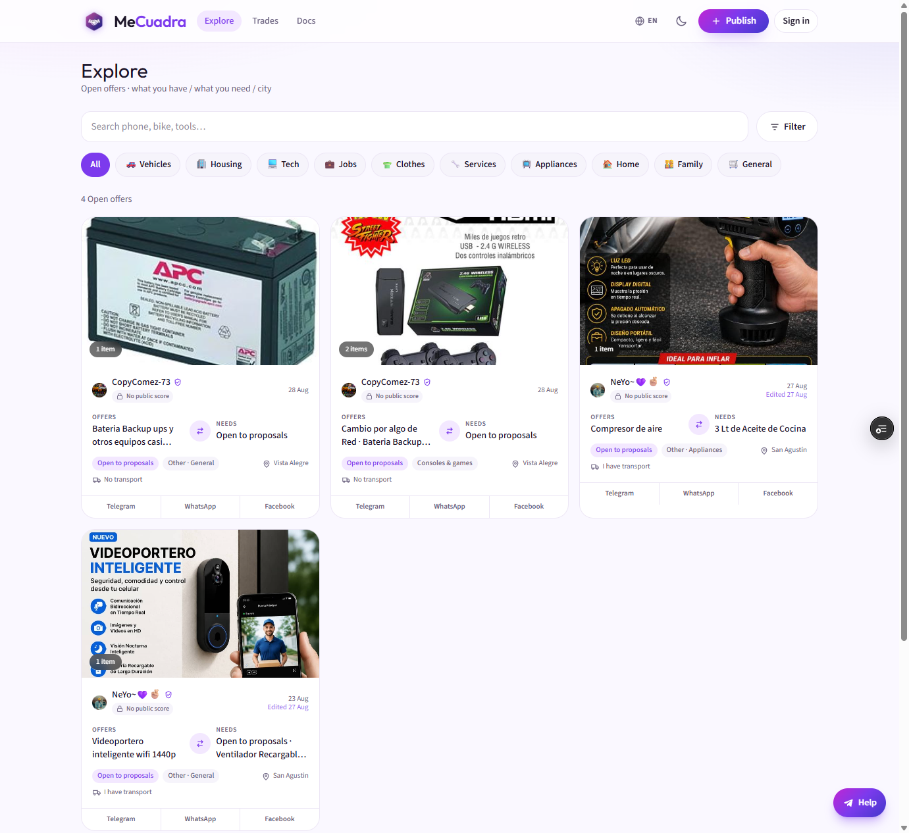
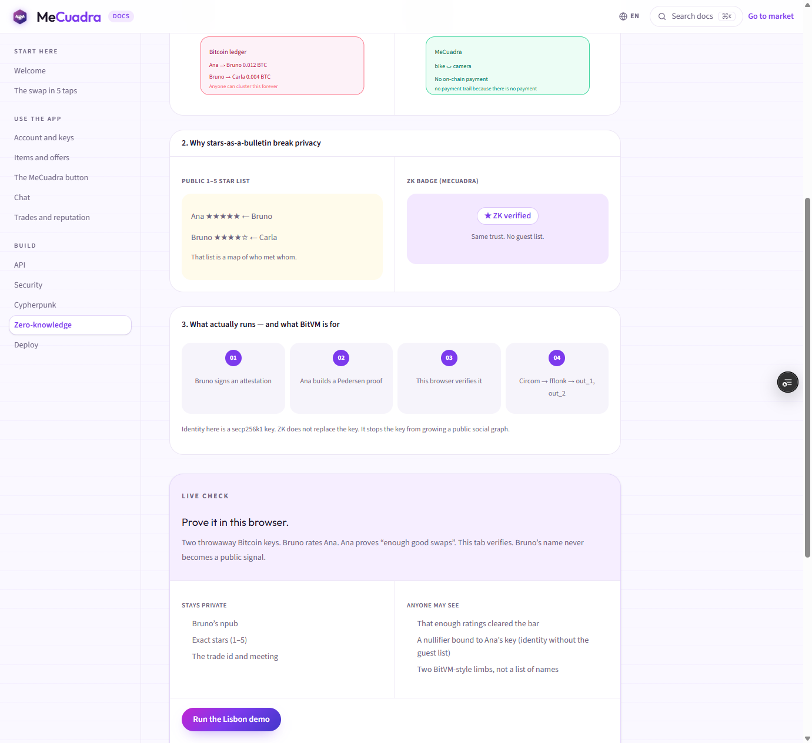

<p align="center">
  
</p>

<h1 align="center">MeCuadra</h1>

<p align="center">
  <strong>Swap goods. Leave no payment trail.</strong><br />
  A global P2P barter market — Bitcoin keys, encrypted chat, ZK reputation.<br />
  No prices. No deposits. No on-chain payment for the bicycle.
</p>

<p align="center">
  <a href="https://mecuadra-git-hackathon-boss-battle-reykratosxx-7776s-projects.vercel.app">Live demo</a>
  ·
  <a href="https://mecuadra-git-hackathon-boss-battle-reykratosxx-7776s-projects.vercel.app/docs">Docs</a>
  ·
  <a href="https://mecuadra-git-hackathon-boss-battle-reykratosxx-7776s-projects.vercel.app/docs/zk">ZK verifier</a>
  ·
  <a href="https://devfolio.co/projects/mecuadra-8c8f">Devfolio</a>
</p>

<p align="center">
  
</p>

---

## What is it?

Most marketplaces assume you are **buying**. Bitcoin’s ledger assumes you are **paying**. Both leave a trail: who paid whom, when, and for how much.

**MeCuadra** is a person-to-person **barter** app. You publish what you have. Someone taps the handshake and proposes what they give. You chat, meet, and close the swap in person.

There is no price in sats, euros, or cash. If someone asks for money, it is not MeCuadra.

> No payment trail because there is no payment.

The name comes from everyday Caribbean Spanish. **Me cuadra** means *this suits me / I’m in / this deal works*. The handshake button is that “yes” — not Buy, Bid, or Pay.

The UI is **English and Spanish** (globe icon in the header).

---

## How a swap works

| | Step | What happens |
| --- | --- | --- |
| 1️⃣ | **Publish** | Photos, what you have, what you need, and a city. No GPS required. |
| 2️⃣ | **Tap MeCuadra** | Someone applies with items they already listed — or writes a free proposal. |
| 3️⃣ | **Chat, meet, confirm** | Coordinate in private chat. Each side marks delivered. Then you rate. |

Reputation is the escrow. There is no frozen balance and no Lightning invoice for the goods.

<p align="center">
  
</p>

---

## Privacy is the default path

Bitcoin’s ledger is public by default. Everyday goods do not need to live on it. MeCuadra also refuses to rebuild that dossier inside the app (phone KYC, server-readable chat, a public list of who traded with whom).

| | Default | What you do *not* do |
| --- | --- | --- |
| 🔑 | Identity is a **secp256k1** key (Bitcoin = Nostr `npub`) | No phone number, no KYC |
| 💬 | Chat is **NIP-44** end-to-end encryption | The server stores ciphertext only |
| 📬 | Contact is a **Silent Payments-style** code | One static code, unique secrets per match |
| 🥜 | Publish uses a **Cashu** anti-spam stamp | Never a sats price for the item |
| 🛰️ | Offers can hit Nostr (kind `31112`) | Telegram is optional legacy, not the gate |
| 🛡️ | Trust is a **ZK badge** this browser re-checks | No public 1–5 star guest list |

<p align="center">
  
</p>

The badge proves *this key collected enough good swaps* without publishing who you met. Runtime proofs are Pedersen commitments + OR range proofs in `src/lib/zk/reputation.ts` (verified in the visitor’s browser). Circom follows [BitVM’s fflonk example](https://github.com/BitVM/bitvm-circom-example) (`out_1` / `out_2`) — we do not fake L1 Groth16 verify.

---

## A worked example

Ana in Lisbon has a folding bike she no longer uses. She wants a 35mm film camera. She does **not** want a euro or sats price.

1. She signs in with a Bitcoin key. MeCuadra never sees the `nsec`.
2. She mints a Cashu stamp and publishes: bike ↔ camera, city Lisbon.
3. Bruno in Porto taps **MeCuadra** and proposes his Olympus. No “pay the difference”.
4. They pick a café in **NIP-44 chat**. The operator cannot read the thread.
5. They meet, both mark delivered, and rate. A ZK badge can show “enough good swaps” without hanging Bruno’s name on Ana’s profile.

If she had *sold* the bike for sats, the ledger would keep a clusterable payment forever. Here there is no payment.

---

## Stack

- **Next.js** (App Router) on Vercel
- **Supabase** — Auth, Postgres, Storage, Realtime
- Login with a Bitcoin / Nostr key (**NIP-07** or `nsec` in the browser)
- Explore is public. Publish and apply need a signed-in key.

---

## Run it locally

```bash
npm install
npm run dev
```

Open [http://localhost:3000](http://localhost:3000). Switch language with the globe.

Use a **separate** Supabase project (do not reuse Cuba production). Copy `.env.local`:

```
NEXT_PUBLIC_SUPABASE_URL=
NEXT_PUBLIC_SUPABASE_ANON_KEY=
SUPABASE_SERVICE_ROLE_KEY=
NEXT_PUBLIC_SITE_URL=http://localhost:3000
NEXT_PUBLIC_CASHU_MINT_URL=https://testnut.cashu.space
NEXT_PUBLIC_NOSTR_RELAYS=wss://relay.damus.io,wss://nos.lol
CASHU_DEMO_SECRET=
MESSAGE_ENCRYPTION_KEY=
```

Then run `supabase/schema.sql` and `supabase/hackathon_cypherpunk.sql`.

`MESSAGE_ENCRYPTION_KEY` is optional on this branch (NIP-44 does not use it).

---

## BOSS Battle

This README lives on `hackathon/boss-battle` for [BOSS Battle](https://boss-battle.devfolio.co) (Bitshala) — tracks **Cypherpunk** and **Freedom Stack**.

Cuba production (Telegram Mini App) stays on `main`. **Do not merge this branch into `main`.**

Demo script, honest limits, and Devfolio copy: [HACKATHON.md](HACKATHON.md).

Built by **Enmanuel Cabrera** ([@manudev97](https://github.com/manudev97) · [devfolio.co/@manudev97](https://devfolio.co/@manudev97)). Repo hosted on [@reykratosxx](https://github.com/reykratosxx) so the Vercel Hobby deploy is not blocked by CPU limits on the primary account.
